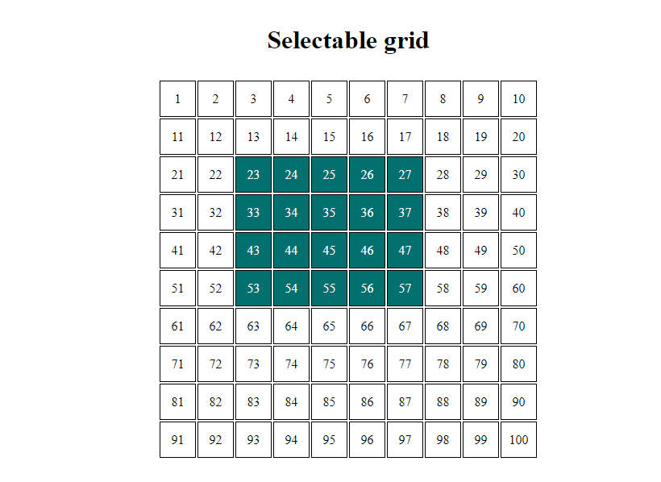

# Selectable Grid

This is a simple React application that demonstrates a selectable grid. Users can click and drag to select multiple boxes in the grid.

## Features

- Select multiple boxes by clicking and dragging
- Highlight selected boxes
- Display box number

## Installation

1. Clone the repository:

## How to Use

- Click and drag to select multiple boxes in the grid.
- The selected boxes will be highlighted.
- The number inside each box represents its position in the grid.

## Technologies Used

- React
- CSS
- TypeScript
